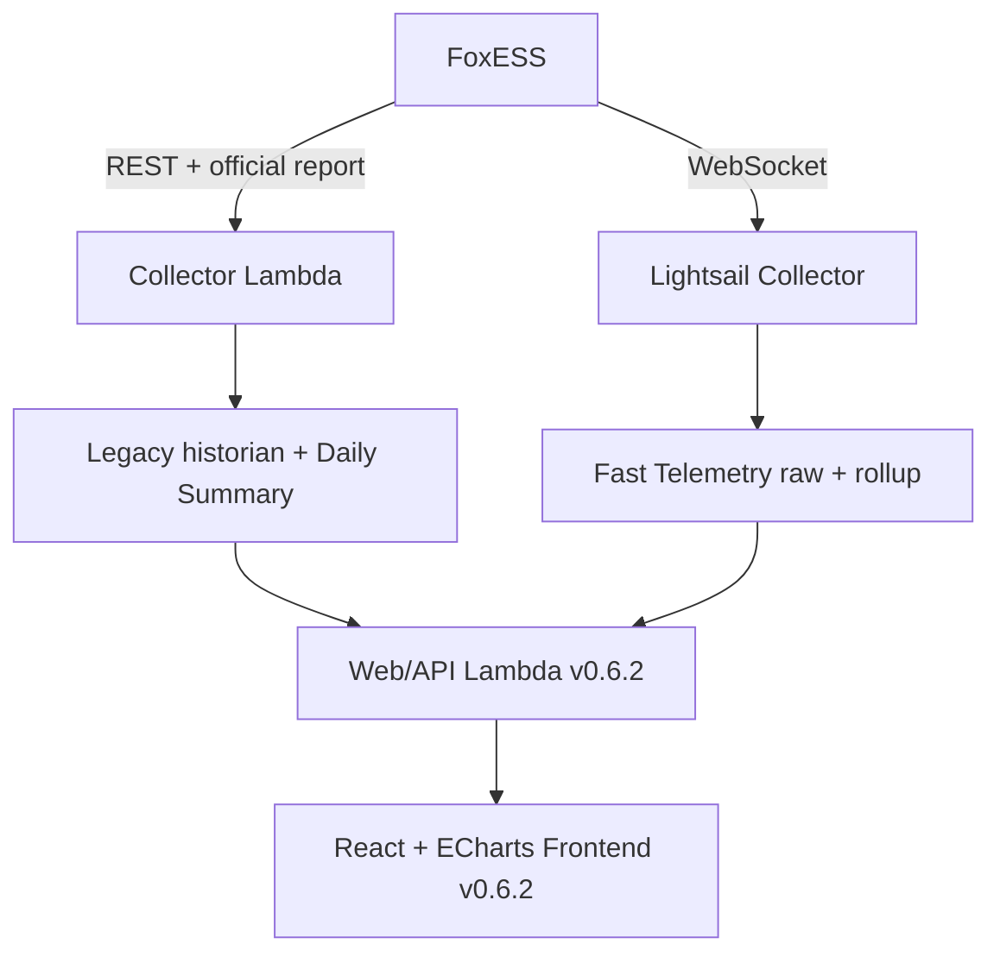

# 家庭能源 SCADA v0.6.2 Architecture

v0.6.2 是 v0.6.1 上的 incremental UX/Web API release，不是 architecture migration。React + TypeScript + Apache ECharts、双 historian ingestion plane、existing auth 与 official Daily Energy semantics 均保留。

## Logical topology

本 release 只部署 Web/API code 与 static Frontend。Collector、Lightsail、EventBridge、DynamoDB schema/data 与 ingestion cadence 不改变。

## Source routing

`FAST_TELEMETRY_START_DATE=2026-10-01`，timezone 为 `Australia/Melbourne`：boundary 前使用 legacy REST ~5m；boundary 起使用 Fast Telemetry；cross-boundary 由 `history_service.py` 分段读并按 timestamp merge。Frontend 不接触 table name，也不自行选择 source。

## Realtime read path

Browser 保持一个 central `/api/history/live?since_ms=<source cursor>` loop：

1. session active 且 tab visible 时立即 poll，之后约每 5 秒 poll；
2. `telemetry_incremental()` Query cursor 后 raw rows，并通过 collector health 指向的最后 persisted raw row补齐 global `latest`；
3. Current Readings 对所有 Historian period 消费 `latest`；
4. selected period 包含 current time 时才把 `points` merge 到 Chart dataset；
5. hidden tab 停止 schedule，visible 时立即 catch-up；
6. polling 不发 activity request，因此不延长 30 分钟 idle session。

Current Readings 与 Historian selected period 的 ownership 自此完全分离。Historical period load 的 `latest` 不会写入 realtime cards；period navigation 也不会清空 global live cursor。

## Current Readings state model

Canonical power fields由 Backend 预先拆为 import/export 与 charge/discharge non-negative channels。`energyFlow.ts` 只比较对应 channels，不重新解释 signed value。Battery nominal capacity 在 `config.ts` 单点读取 `VITE_BATTERY_CAPACITY_KWH`（default 28）；estimated kWh 为纯 presentation calculation。

Stale state由 source timestamp age 与 collector health共同决定。Status colour 只作用于小型 flow accent；SOC threshold colour只作用于 SOC value；stale styling优先于两者。

## Historian resolution 与 gap

| Period | Fast display read | Peak read |
| --- | --- | --- |
| Day | raw ~5s | raw value + source timestamp |
| Week | 1m rollup envelope | one-minute `max/max_ts` |
| Month | 15m aggregate envelope | one-minute `max/max_ts` |

Storage/API 不插值或制造 timestamp。ECharts `connectNulls: true` 仅做 visual bridging；future selected-period 区域保持 blank。

## Peak analytics

`range_summary()` 在 Web/API analytics layer 计算 PV、Home Load、Grid Import、Grid Export peaks：

- legacy segment：raw legacy rows，约 5m resolution；
- Fast segment <= 2 days：5s raw rows；
- Fast longer range：读取 existing one-minute rollup `max/max_ts`，不读整月 5s raw；
- cross-source：比较 candidate，返回 winning value、timestamp、source 与 sample resolution metadata。

Chart average points从不作为 Peak source。Daily Energy totals仍由 FoxESS official report提供。

## ECharts interaction adapter

ECharts native pan/wheel/pinch disabled，`dataZoom` only X-axis。Application Pointer Events adapter提供 Desktop/Mobile Drag-select；Mobile pending gesture 使用 horizontal cone 与 vertical dominance intent detection，一旦 horizontal lock 就 setPointerCapture 并阻止 scroll，vertical-dominant gesture保持 page scroll。

Selection mode通过 event suppression 与 `.echart.is-selecting .historian-tooltip` 双重关闭 Tooltip，overlay不含文字。Desktop Hover、Mobile pinned Tap Tooltip、Sync Zoom state machine、Global Restore 与 full-period baseRange均沿用 v0.6.1 contract。

## Security、cache 与 deployment

- Session cookie、origin validation、CSP、30-minute idle logout不变。
- HTML/API/live为 `no-store`；hashed assets immutable。
- Frontend build不含 AWS/FoxESS credentials。
- Web/API package包含 Python read/analytics modules与 static routing entry；Frontend package只含 built HTML/JS/CSS/assets。
- Rollback回到 v0.6.1 Frontend + v0.6.0 Web/API（即 v0.6.1 production Web baseline），不做 data migration。

Architecture decisions 见 `docs/adr/`。
